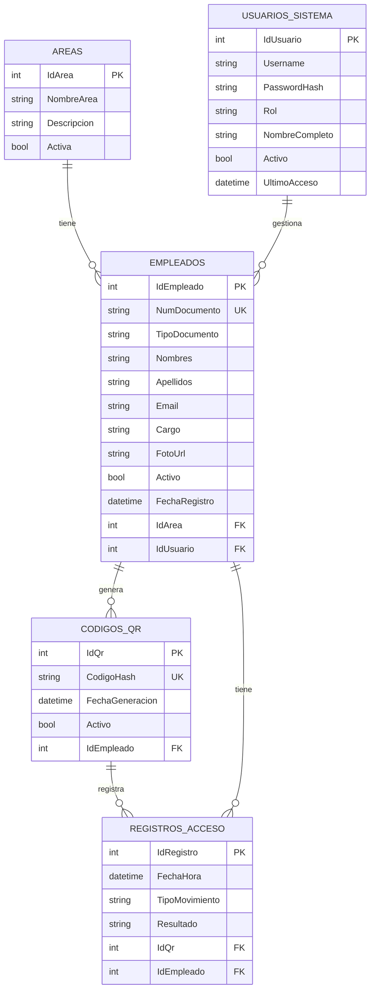

# QR Code Access - Backend

API REST para sistema de control de acceso mediante códigos QR. Desarrollada con ASP.NET Core 9 y arquitectura limpia (Clean Architecture).

## Tecnologías

- **.NET 9** - Framework principal
- **ASP.NET Core Web API** - Capa de presentación
- **Entity Framework Core 9** - ORM para acceso a datos
- **PostgreSQL** - Base de datos relacional
- **JWT Bearer** - Autenticación basada en tokens
- **BCrypt** - Hashing de contraseñas
- **Swagger / OpenAPI** - Documentación de la API
- **QuestPDF** - Generación de reportes PDF
- **ClosedXML** - Generación de reportes Excel
- **FluentValidation** - Validación de DTOs
- **AutoMapper** - Mapeo objeto-objeto

## Arquitectura

```
src/
├── QrCodeAccess.Domain/          # Entidades, enums y value objects
├── QrCodeAccess.Application/     # DTOs, interfaces, servicios de aplicación, mapeos, validadores
├── QrCodeAccess.Infrastructure/  # DbContext, repositorios, servicios (JWT, reportes, passwords)
└── QrCodeAccess.Api/            # Controladores, middleware, configuración
```

## Requisitos

- [.NET 9 SDK](https://dotnet.microsoft.com/download/dotnet/9.0)
- [PostgreSQL](https://www.postgresql.org/download/) (14+)

## Configuración

1. Clonar el repositorio:

```bash
git clone <repo-url>
cd QRcode_access_Backend
```

2. Configurar la conexión a PostgreSQL en `src/QrCodeAccess.Api/appsettings.json`:

```json
"ConnectionStrings": {
  "DefaultConnection": "Host=localhost;Port=5432;Database=QrCodeAccessDb;Username=postgres;Password=postgres"
}
```

3. Configurar la clave JWT (mínimo 32 caracteres):

```json
"Jwt": {
  "Key": "TuClaveSuperSeguraDeAlMenos32Caracteres!",
  "Issuer": "QrCodeAccessApi",
  "Audience": "QrCodeAccessFrontend"
}
```

## Ejecución

```bash
dotnet run --project src/QrCodeAccess.Api
```

La API se inicia en:

- HTTP: `http://localhost:5057`
- HTTPS: `https://localhost:7283`
- Swagger: `http://localhost:5057/swagger`

Al iniciar, las migraciones de base de datos se aplican automáticamente.

## Migraciones

```bash
# Aplicar migraciones manualmente
dotnet ef database update --project src/QrCodeAccess.Infrastructure --startup-project src/QrCodeAccess.Api

# Crear nueva migración
dotnet ef migrations add NombreMigracion --project src/QrCodeAccess.Infrastructure --startup-project src/QrCodeAccess.Api --output-dir Data/Migrations

# Eliminar última migración
dotnet ef migrations remove --project src/QrCodeAccess.Infrastructure --startup-project src/QrCodeAccess.Api
```

## Endpoints

### Autenticación

| Método | Ruta           | Descripción      |
| ------ | -------------- | ---------------- |
| POST   | `/auth/login`  | Inicio de sesión |
| POST   | `/auth/logout` | Cierre de sesión |

### Empleados

| Método | Ruta              | Descripción         |
| ------ | ----------------- | ------------------- |
| GET    | `/empleados`      | Listar empleados    |
| POST   | `/empleados`      | Registrar empleado  |
| GET    | `/empleados/{id}` | Consultar empleado  |
| PUT    | `/empleados/{id}` | Actualizar empleado |
| DELETE | `/empleados/{id}` | Desactivar empleado |

### Áreas

| Método | Ruta          | Descripción     |
| ------ | ------------- | --------------- |
| GET    | `/areas`      | Listar áreas    |
| POST   | `/areas`      | Crear área      |
| PUT    | `/areas/{id}` | Actualizar área |
| DELETE | `/areas/{id}` | Eliminar área   |

### Códigos QR

| Método | Ruta                       | Descripción          |
| ------ | -------------------------- | -------------------- |
| POST   | `/qr/generar/{idEmpleado}` | Generar/regenerar QR |
| POST   | `/qr/validar`              | Validar QR escaneado |
| GET    | `/qr/{idEmpleado}`         | Consultar QR activo  |

### Accesos

| Método | Ruta                              | Descripción              |
| ------ | --------------------------------- | ------------------------ |
| GET    | `/accesos`                        | Historial de accesos     |
| GET    | `/accesos/{idEmpleado}/historial` | Historial de un empleado |

### Dashboard

| Método | Ruta               | Descripción                |
| ------ | ------------------ | -------------------------- |
| GET    | `/dashboard/stats` | Estadísticas del dashboard |

### Reportes

| Método | Ruta                      | Descripción              |
| ------ | ------------------------- | ------------------------ |
| GET    | `/reportes/accesos/pdf`   | Exportar accesos a PDF   |
| GET    | `/reportes/accesos/excel` | Exportar accesos a Excel |

## Modelo de datos



## Variables de entorno (opcional)

Las siguientes variables de entorno sobrescriben los valores de `appsettings.json`:

| Variable                               | Descripción                     |
| -------------------------------------- | ------------------------------- |
| `ConnectionStrings__DefaultConnection` | Cadena de conexión a PostgreSQL |
| `Jwt__Key`                             | Clave secreta para JWT          |
| `Cors__AllowedOrigins__0`              | Origen CORS permitido           |

## Plan de implementación para el frontend

### 1) Preparar el entorno

- Node.js 18+ y un gestor de paquetes (npm, pnpm o yarn).
- Configurar la URL base de la API: `http://localhost:5057`.

### 2) Conectar con la API

- Definir un cliente HTTP (por ejemplo, Axios o fetch) apuntando a `http://localhost:5057`.
- Usar `/auth/login` para obtener el token JWT y guardarlo en almacenamiento seguro del navegador.
- Incluir el token en el header `Authorization: Bearer <token>` en todas las llamadas protegidas.

### 3) Estructura mínima de pantallas

- Login.
- Dashboard (consume `/dashboard/stats`).
- Empleados (CRUD con `/empleados`).
- Áreas (CRUD con `/areas`).
- Accesos e historial (`/accesos`, `/accesos/{idEmpleado}/historial`).
- QR (generación y validación: `/qr/generar/{idEmpleado}`, `/qr/validar`).

### 4) CORS

- Asegurar que el frontend esté agregado en `Cors:AllowedOrigins` (ej. `http://localhost:5173`).

### 5) Verificación rápida

- Con la API en ejecución, abrir Swagger en `http://localhost:5057/swagger` y validar respuestas.
- Probar login y endpoints principales desde el frontend.

## Licencia

MIT
